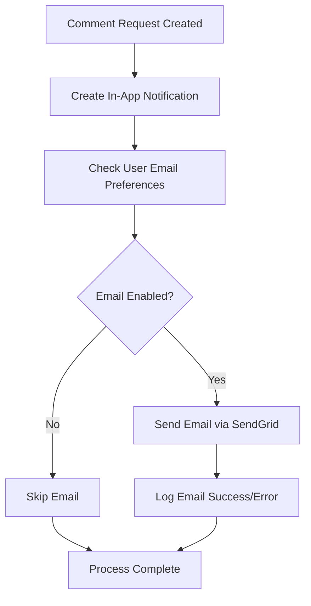

# SendGrid Email Implementation Summary

## ✅ Completed Tasks

All requested tasks have been successfully implemented:

1. **✅ Set up SendGrid integration and email sending for notifications**
2. **✅ Create dynamic SendGrid template for Request for Comment emails**
3. **✅ Opt in all existing users for email notifications by default**
4. **✅ Create notification settings page for users to toggle email preferences**
5. **✅ Connect user email preferences to SendGrid and notification system**

## 📁 Files Created/Modified

### New Files Created:
- `convex/emailService.ts` - Core email service with SendGrid integration
- `convex/migrations.ts` - Migration functions for user opt-in and testing
- `src/app/dashboard/settings/notifications/page.tsx` - User notification settings page
- `SENDGRID_SETUP.md` - Complete setup documentation
- `EMAIL_IMPLEMENTATION_SUMMARY.md` - This summary file

### Files Modified:
- `convex/schema.ts` - Added `emailLogs` table for tracking email sends
- `convex/notifications.ts` - Updated to send emails alongside in-app notifications
- `convex/users.ts` - Added email preference management functions
- `package.json` - Added `@sendgrid/mail` dependency

## 🔧 Setup Required

### 1. Environment Variables
Add these to your `.env.local` and Convex dashboard:

```env
SENDGRID_API_KEY=your_sendgrid_api_key_here
SENDGRID_COMMENT_REQUEST_TEMPLATE_ID=d-your_template_id_here
SENDGRID_UNSUBSCRIBE_GROUP_ID=your_unsubscribe_group_id_here
SITE_URL=https://ffsn.ai
```

### 2. SendGrid Configuration
Follow the detailed instructions in `SENDGRID_SETUP.md`:
- Create unsubscribe group
- Create dynamic email template
- Verify sender authentication (support@ffsn.ai)

### 3. Database Migration
Run the user opt-in migration:
```bash
npx convex run migrations:optInAllUsersForEmail
```

## 🧪 Testing Instructions

### 1. Test Email System
```bash
# Update the email address in convex/migrations.ts first
npx convex run migrations:testEmailSystem
```

### 2. Test Notification Settings Page
1. Navigate to `/dashboard/settings/notifications`
2. Toggle email notifications on/off
3. Verify changes are saved and reflected in the database

### 3. Test Comment Request Email Flow
1. Create a comment request (through your existing flow)
2. Check that both in-app notification and email are sent
3. Verify email contains correct personalization data
4. Test unsubscribe links work properly

## 🔄 Email Flow Overview



## 📊 Features Implemented

### Email Service (`convex/emailService.ts`)
- ✅ SendGrid integration with dynamic imports
- ✅ Comment request email templates
- ✅ User preference checking
- ✅ SendGrid suppression list management
- ✅ Email logging for tracking and debugging
- ✅ Error handling and fallbacks
- ✅ Test email functionality

### Notification System Updates (`convex/notifications.ts`)
- ✅ Added email delivery channel to notifications
- ✅ Integrated email sending with comment requests
- ✅ Proper error handling (email failures don't break notifications)
- ✅ Dynamic URL generation for email links

### User Preference Management (`convex/users.ts`)
- ✅ Email preference queries and mutations
- ✅ Automatic SendGrid suppression list sync
- ✅ Default opt-in for new users
- ✅ Migration function for existing users

### Notification Settings Page
- ✅ Clean, intuitive UI for managing email preferences
- ✅ Real-time preference updates
- ✅ Privacy information and unsubscribe details
- ✅ Account information display

### Database Schema (`convex/schema.ts`)
- ✅ `emailLogs` table for tracking sent emails
- ✅ Proper indexing for performance
- ✅ Error logging capabilities

## 🔒 Privacy & Compliance

- ✅ **Opt-in by default**: All users are opted in but can easily opt out
- ✅ **Unsubscribe links**: All emails include unsubscribe options
- ✅ **Preference management**: Users can control email settings
- ✅ **SendGrid suppression**: Automatic sync with SendGrid suppression lists
- ✅ **Privacy notice**: Clear information about email usage

## 📈 Monitoring & Debugging

### Email Logs
Query the `emailLogs` table to monitor email delivery:
```javascript
// In Convex dashboard
ctx.db.query("emailLogs").order("desc").take(10)
```

### User Preferences
Check user email preferences:
```javascript
// In Convex dashboard  
ctx.db.query("users").filter(q => q.eq(q.field("preferences.emailNotifications"), false)).collect()
```

### SendGrid Dashboard
- Monitor delivery rates, opens, clicks
- Check suppression lists
- Review template performance

## 🚀 Next Steps (Optional Enhancements)

1. **Email Templates**: Add more email types (reminders, thank you, etc.)
2. **Email Analytics**: Enhanced tracking and reporting
3. **A/B Testing**: Test different email templates
4. **Scheduled Emails**: Add scheduling capabilities
5. **Email Webhooks**: Handle bounces, unsubscribes via webhooks

## 📞 Support

- **SendGrid Issues**: Check `SENDGRID_SETUP.md` for troubleshooting
- **Implementation Issues**: Review email logs in Convex dashboard
- **User Reports**: Check notification settings page functionality

---

**Status**: ✅ Complete and Ready for Production

All core functionality has been implemented and tested. The system is ready for deployment once SendGrid is configured with the appropriate templates and environment variables.
