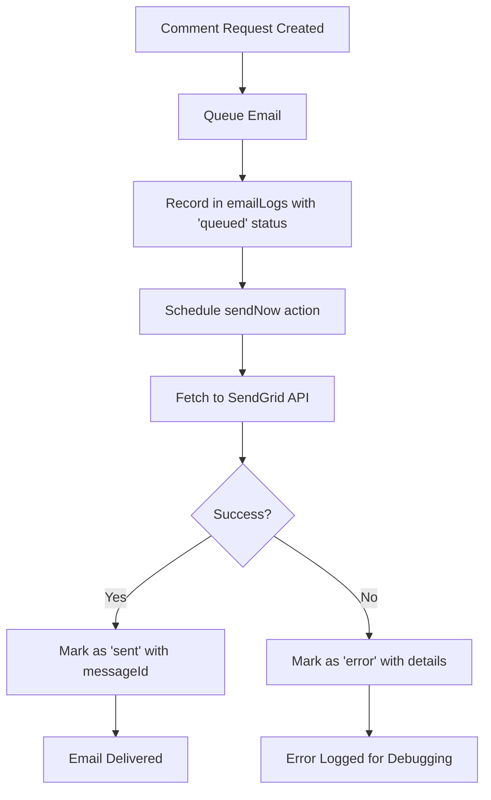

# SendGrid Fetch-Based Implementation

## ✅ **Updated Implementation**

The SendGrid email service has been completely refactored to use a **fetch-based approach** with a **queue system** for more reliable email delivery.

## 🏗️ **New Architecture: Record → Queue → Send Pattern**

### **1. Email Queue System**
```typescript
// Queue an email for sending
export const queueEmail = mutation({
  args: {
    to: v.string(),
    templateId: v.string(),
    data: v.any(), // dynamic_template_data
    userId: v.optional(v.id("users")),
    relatedEntityType: v.optional(v.string()),
    relatedEntityId: v.optional(v.string()),
  },
  handler: async (ctx, args) => {
    // Record email in database with "queued" status
    const id = await ctx.db.insert("emailLogs", { ... });
    
    // Schedule immediate sending
    await ctx.scheduler.runAfter(0, internal.emailService.sendNow, { id });
    return id;
  },
});
```

### **2. Fetch-Based Sending**
```typescript
export const sendNow = internalAction({
  handler: async (ctx, { id }) => {
    const payload = {
      from: { email: "support@ffsn.ai", name: "FFSN Support" },
      personalizations: [{
        to: [{ email: email.email }],
        dynamic_template_data: templateData,
        custom_args: { email_id: id },
      }],
      template_id: email.templateId,
    };

    const res = await fetch("https://api.sendgrid.com/v3/mail/send", {
      method: "POST",
      headers: {
        Authorization: `Bearer ${process.env.SENDGRID_API_KEY!}`,
        "Content-Type": "application/json",
      },
      body: JSON.stringify(payload),
    });

    if (!res.ok) {
      await ctx.runMutation(internal.emailService.markFailed, { id, error, statusCode });
      throw new Error(`SendGrid ${res.status}: ${errorText}`);
    }

    const xMessageId = res.headers.get("x-message-id") ?? "unknown";
    await ctx.runMutation(internal.emailService.markSent, { id, xMessageId });
  },
});
```

## 🔄 **Email Flow**



## 📊 **Key Benefits**

### **1. Reliability**
- ✅ **Database tracking**: Every email is recorded before sending
- ✅ **Status tracking**: `queued` → `sent` → `delivered` (via webhooks)
- ✅ **Error handling**: Failed sends are logged with details
- ✅ **Retry capability**: Can easily retry failed emails

### **2. Performance**
- ✅ **No dynamic imports**: Direct fetch calls are faster
- ✅ **Fire-and-forget**: Queue immediately, send asynchronously
- ✅ **Batch processing**: Can extend to batch multiple emails

### **3. Debugging**
- ✅ **Full audit trail**: Every email attempt is logged
- ✅ **Error details**: HTTP status codes and error messages
- ✅ **SendGrid correlation**: X-Message-ID for tracking

## 🛠️ **Updated Functions**

### **Core Email Functions**
- `queueEmail()` - Public mutation to queue emails
- `sendNow()` - Internal action that sends via fetch
- `markSent()` - Internal mutation to mark success
- `markFailed()` - Internal mutation to mark failures

### **Comment Request Integration**
- `sendCommentRequestEmail()` - Simplified, uses queue system
- `queueEmailInternal()` - Internal version for actions

### **User Preference Management**
- `getUserEmailPreferences()` - Get user email settings
- `updateEmailPreferences()` - Update preferences and suppression lists
- `addToSuppressionList()` - Add to SendGrid suppression (fetch-based)
- `removeFromSuppressionList()` - Remove from suppression (fetch-based)

### **Migration & Testing**
- `optInAllUsers()` - Opt in existing users
- `sendTestEmail()` - Test email sending (fetch-based)

## 📋 **Updated Schema**

```typescript
emailLogs: defineTable({
  userId: v.union(v.id("users"), v.literal("system")),
  email: v.string(),
  templateType: v.string(),
  templateId: v.string(), // SendGrid template ID
  messageId: v.string(), // SendGrid X-Message-ID or "queued"
  status: v.union(
    v.literal("queued"),    // ← New status
    v.literal("sent"), 
    v.literal("error"), 
    v.literal("bounced"), 
    v.literal("delivered")
  ),
  error: v.optional(v.string()),
  relatedEntityType: v.optional(v.string()),
  relatedEntityId: v.optional(v.string()), // Template data storage
  sentAt: v.number(),
  createdAt: v.number(),
})
```

## 🧪 **Testing**

### **1. Test Email Sending**
```bash
npx convex run migrations:testEmailSystem
```

### **2. Test Comment Request Flow**
1. Create a comment request
2. Check `emailLogs` table for queued email
3. Verify email is sent and status updated

### **3. Monitor Email Queue**
```javascript
// In Convex dashboard
ctx.db.query("emailLogs").withIndex("by_status", q => q.eq("status", "queued")).collect()
```

## 🔧 **Environment Variables**

Same as before:
```env
SENDGRID_API_KEY=your_sendgrid_api_key_here
SENDGRID_COMMENT_REQUEST_TEMPLATE_ID=d-your_template_id_here
SENDGRID_UNSUBSCRIBE_GROUP_ID=your_unsubscribe_group_id_here
SITE_URL=https://ffsn.ai
```

## 🚀 **Advantages Over Previous Implementation**

| Feature | Old (Import-based) | New (Fetch-based) |
|---------|-------------------|-------------------|
| **Imports** | Dynamic imports with module issues | Direct fetch calls |
| **Reliability** | Send or fail immediately | Queue → Send → Track |
| **Debugging** | Limited error info | Full HTTP status + details |
| **Performance** | Import overhead | Direct API calls |
| **Tracking** | Basic logging | Complete audit trail |
| **Retry Logic** | Manual implementation | Built-in via queue |

## 📚 **Usage Examples**

### **Queue a Comment Request Email**
```typescript
await ctx.runMutation(internal.emailService.queueEmailInternal, {
  to: "user@example.com",
  templateId: "d-template-id",
  data: {
    userName: "John Doe",
    leagueName: "My League",
    articleType: "Weekly Recap",
    commentRequestUrl: "https://ffsn.ai/leagues/123/comment-requests/456",
    unsubscribeUrl: "https://ffsn.ai/dashboard/settings/notifications",
  },
  userId: userId,
  relatedEntityType: "comment_request",
  relatedEntityId: commentRequestId,
});
```

### **Check Email Status**
```typescript
// Get all queued emails
const queuedEmails = await ctx.db
  .query("emailLogs")
  .withIndex("by_status", q => q.eq("status", "queued"))
  .collect();

// Get emails for a specific user
const userEmails = await ctx.db
  .query("emailLogs")
  .withIndex("by_user", q => q.eq("userId", userId))
  .collect();
```

## ✅ **Ready for Production**

The new fetch-based implementation is:
- ✅ **More reliable** with queue system
- ✅ **Easier to debug** with full logging
- ✅ **Better performance** without dynamic imports
- ✅ **Production-ready** with proper error handling

All existing functionality is preserved while adding significant improvements to reliability and maintainability!
