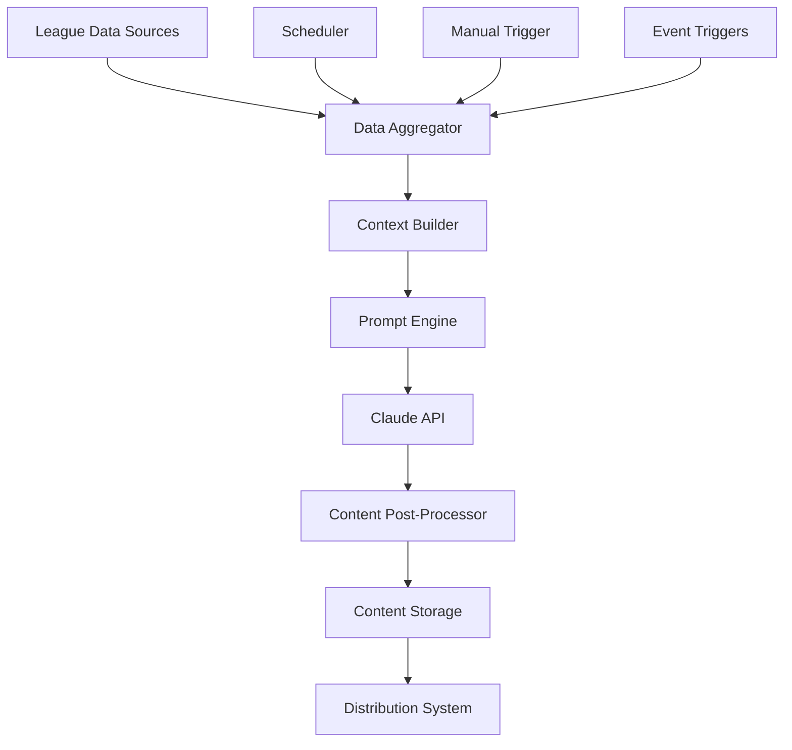

# FFSN AI Content Generation System Plan

## Overview
This document outlines the comprehensive plan for implementing AI-generated content in FFSN, leveraging Claude Sonnet 4 for creative sports writing across 5 distinct personas and 27 content types.

## 1. Architecture Overview

### Core Components

```typescript
// Core system architecture
interface ContentGenerationSystem {
  // AI Service Layer
  aiService: {
    provider: "anthropic";
    model: "claude-sonnet-4-20250514";
    fallbackModel: "claude-3-7-sonnet-20250219";
    maxTokens: 64000;
    temperature: 0.8; // Higher for creative writing
  };

  // Content Pipeline
  pipeline: {
    dataCollection: DataCollector;
    promptGeneration: PromptEngine;
    contentGeneration: ContentGenerator;
    postProcessing: ContentProcessor;
    storage: ContentStorage;
    distribution: ContentDistributor;
  };

  // Scheduling System
  scheduler: {
    cronJobs: CronJobManager;
    queueSystem: BullMQ;
    priorities: ContentPriorityManager;
  };
}
```

## 2. Data Flow Architecture



## 3. Content Generation Pipeline

### Step 1: Data Collection
```typescript
interface LeagueDataContext {
  // Current week data
  currentWeek: {
    number: number;
    matchups: MatchupData[];
    scores: TeamScores[];
    playerPerformances: PlayerStats[];
  };
  
  // Historical data
  historical: {
    seasonRecords: TeamRecord[];
    headToHead: H2HRecord[];
    tradeHistory: Trade[];
    draftResults: DraftPick[];
  };
  
  // League metadata
  metadata: {
    leagueName: string;
    scoringType: string;
    rosterSettings: RosterConfig;
    playoffStructure: PlayoffConfig;
  };
  
  // Team/Manager info
  teams: {
    teamId: string;
    name: string;
    manager: string;
    record: TeamRecord;
    roster: Player[];
    recentTransactions: Transaction[];
  }[];
}
```

### Step 2: Prompt Engineering System
```typescript
interface PromptTemplate {
  contentType: ContentType;
  persona: PersonaType;
  
  systemPrompt: string;
  contextTemplate: string;
  
  // Dynamic sections based on available data
  requiredData: DataRequirement[];
  optionalEnhancements: Enhancement[];
  
  // Persona-specific modifications
  personaModifiers: {
    tone: string;
    vocabulary: string[];
    catchphrases: string[];
    biases: string[];
  };
}
```

### Step 3: Content Generation
```typescript
async function generateContent(
  leagueId: string,
  contentType: ContentType,
  persona: PersonaType,
  options?: GenerationOptions
): Promise<GeneratedContent> {
  // 1. Collect league data
  const leagueData = await collectLeagueData(leagueId);
  
  // 2. Build context
  const context = await buildContext(leagueData, contentType);
  
  // 3. Generate prompt
  const prompt = await generatePrompt(context, contentType, persona);
  
  // 4. Call Claude API
  const content = await callClaudeAPI(prompt, {
    model: "claude-sonnet-4-20250514",
    maxTokens: getMaxTokensForContent(contentType),
    temperature: getTemperatureForPersona(persona)
  });
  
  // 5. Post-process
  const processed = await postProcessContent(content, {
    validateFactualAccuracy: true,
    ensurePersonaConsistency: true,
    formatForPlatform: true
  });
  
  return processed;
}
```

## 4. Scheduled Content System

### Automatic Generation Schedule
```typescript
const contentSchedule = {
  // Weekly recurring content
  weekly: [
    {
      contentType: "weekly_preview",
      dayOfWeek: 4, // Thursday
      time: "09:00",
      persona: "random", // Rotate personas
      priority: "high"
    },
    {
      contentType: "waiver_wire_report",
      dayOfWeek: 2, // Tuesday
      time: "06:00",
      persona: "stan-deviation",
      priority: "high"
    },
    {
      contentType: "weekly_recap",
      dayOfWeek: 2, // Tuesday
      time: "12:00",
      persona: "rick-two-beers",
      priority: "medium"
    },
    {
      contentType: "power_rankings",
      dayOfWeek: 3, // Wednesday
      time: "15:00",
      persona: ["mel-diaper", "stan-deviation"], // Alternate
      priority: "medium"
    }
  ],
  
  // Event-triggered content
  eventBased: [
    {
      event: "trade_completed",
      contentType: "trade_analysis",
      delay: "30m", // 30 minutes after trade
      persona: "vinny-marinara",
      priority: "high"
    },
    {
      event: "upset_victory", // Underdog wins by 20+ points
      contentType: "emergency_hot_takes",
      delay: "immediate",
      persona: "mel-diaper",
      priority: "medium"
    }
  ],
  
  // Milestone content
  milestones: [
    {
      week: 8,
      contentType: "mid_season_awards",
      persona: "mel-diaper"
    },
    {
      week: 12,
      contentType: "playoff_prep_guide",
      persona: "stan-deviation"
    }
  ]
};
```

### Queue Implementation
```typescript
// Using BullMQ for job queue management
import { Queue, Worker } from 'bullmq';

const contentQueue = new Queue('content-generation', {
  connection: redis,
  defaultJobOptions: {
    attempts: 3,
    backoff: {
      type: 'exponential',
      delay: 2000
    }
  }
});

// Worker to process content generation jobs
const contentWorker = new Worker('content-generation', async (job) => {
  const { leagueId, contentType, persona, options } = job.data;
  
  try {
    const content = await generateContent(
      leagueId,
      contentType,
      persona,
      options
    );
    
    // Store generated content
    await storeContent(content);
    
    // Notify subscribers
    await notifySubscribers(leagueId, content);
    
    return content;
  } catch (error) {
    console.error('Content generation failed:', error);
    throw error;
  }
}, {
  connection: redis,
  concurrency: 5 // Process up to 5 jobs simultaneously
});
```

## 5. Commissioner Manual Generation Interface

### UI Component Design
```tsx
interface ContentGeneratorProps {
  league: League;
  availableCredits: number;
}

export function ContentGenerator({ league, availableCredits }: ContentGeneratorProps) {
  const [selectedContentType, setSelectedContentType] = useState<ContentType>();
  const [selectedPersona, setSelectedPersona] = useState<PersonaType>();
  const [customContext, setCustomContext] = useState<string>("");
  const [isGenerating, setIsGenerating] = useState(false);
  
  return (
    <div className="content-generator">
      {/* Content Type Selection */}
      <ContentTypeSelector
        contentTypes={getAvailableContentTypes(league)}
        selected={selectedContentType}
        onChange={setSelectedContentType}
      />
      
      {/* Persona Selection */}
      <PersonaSelector
        personas={getRecommendedPersonas(selectedContentType)}
        selected={selectedPersona}
        onChange={setSelectedPersona}
      />
      
      {/* Custom Context Input */}
      <ContextInput
        placeholder="Add any specific context or events to include..."
        value={customContext}
        onChange={setCustomContext}
      />
      
      {/* Generation Preview */}
      <GenerationPreview
        contentType={selectedContentType}
        persona={selectedPersona}
        estimatedCredits={calculateCredits(selectedContentType)}
        availableCredits={availableCredits}
      />
      
      {/* Generate Button */}
      <GenerateButton
        onClick={() => generateContent()}
        disabled={!canGenerate()}
        loading={isGenerating}
      />
    </div>
  );
}
```

## 6. Welcome Content for Imported Leagues

### Historical Data Analysis
```typescript
async function generateWelcomeContent(leagueId: string) {
  const historicalData = await analyzeHistoricalData(leagueId);
  
  const welcomePackage = {
    // 1. League History Overview
    leagueOverview: await generateContent(leagueId, "league_history_retrospective", "rick-two-beers", {
      focus: ["dynasty_teams", "memorable_moments", "historical_trades"]
    }),
    
    // 2. Team Power Rankings
    powerRankings: await generateContent(leagueId, "all_time_power_rankings", "stan-deviation", {
      includeStats: true,
      timeframe: "all_time"
    }),
    
    // 3. Rivalry Analysis
    rivalries: await generateContent(leagueId, "rivalry_analysis", "chad-thunderhype", {
      topRivalries: 3,
      includeHistory: true
    }),
    
    // 4. Hall of Fame/Shame
    hallOfFame: await generateContent(leagueId, "hall_of_fame", "mel-diaper", {
      categories: ["best_draft", "worst_trade", "biggest_upset", "dynasty_team"]
    })
  };
  
  return welcomePackage;
}
```

## 7. Content Storage & Retrieval

### Enhanced Schema
```typescript
// Update convex/schema.ts
aiContent: defineTable({
  // Core fields
  leagueId: v.id("leagues"),
  type: v.string(),
  persona: v.string(),
  title: v.string(),
  content: v.string(),
  summary: v.string(), // Brief summary for previews
  
  // Enhanced metadata
  metadata: v.object({
    week: v.optional(v.number()),
    season: v.optional(v.number()),
    featuredTeams: v.array(v.id("teams")),
    featuredPlayers: v.array(v.string()),
    tags: v.array(v.string()),
    creditsUsed: v.number(),
    generationTime: v.number(), // ms
    modelUsed: v.string(),
    promptTokens: v.number(),
    completionTokens: v.number(),
  }),
  
  // Content management
  status: v.union(
    v.literal("generating"),
    v.literal("draft"),
    v.literal("published"),
    v.literal("scheduled"),
    v.literal("failed")
  ),
  scheduledFor: v.optional(v.number()),
  publishedAt: v.optional(v.number()),
  
  // Engagement tracking
  engagement: v.object({
    views: v.number(),
    likes: v.number(),
    shares: v.number(),
    comments: v.array(v.id("comments"))
  }),
  
  // Versioning
  version: v.number(),
  previousVersionId: v.optional(v.id("aiContent")),
  
  createdAt: v.number(),
  updatedAt: v.number(),
})
  .index("by_league", ["leagueId"])
  .index("by_status", ["status"])
  .index("by_type", ["type"])
  .index("by_scheduled", ["scheduledFor"])
  .index("by_league_published", ["leagueId", "publishedAt"]),
```

## 8. Credit System & Billing

### Credit Pricing Model
```typescript
const creditPricing = {
  // Credit packages
  packages: [
    { credits: 100, price: 9.99, bonus: 0 },
    { credits: 500, price: 39.99, bonus: 50 }, // 550 total
    { credits: 1000, price: 69.99, bonus: 150 }, // 1150 total
  ],
  
  // Content type costs (from ffsn-content-types.md)
  contentCosts: {
    // Weekly content
    weekly_preview: 10,
    weekly_recap: 10,
    power_rankings: 8,
    waiver_wire_report: 12,
    
    // Premium content
    custom_roast: 25,
    dynasty_rankings: 15,
    season_recap: 20,
    
    // Quick content
    emergency_hot_takes: 5,
    trade_analysis: 5,
  },
  
  // Commissioner bonuses
  commissionerBenefits: {
    monthlyFreeCredits: 50,
    discountPercentage: 20
  }
};
```

## 9. Quality Control & Moderation

### Automated Quality Checks
```typescript
interface QualityControl {
  // Factual accuracy
  factChecking: {
    verifyScores: boolean;
    verifyRecords: boolean;
    verifyPlayerStats: boolean;
    flagInconsistencies: boolean;
  };
  
  // Content standards
  contentFilters: {
    profanityFilter: "strict" | "moderate" | "off";
    personalAttacks: "block" | "flag" | "allow";
    controversialTopics: string[];
  };
  
  // Persona consistency
  personaValidation: {
    toneAnalysis: boolean;
    vocabularyCheck: boolean;
    catchphraseUsage: boolean;
  };
}
```

## 10. API Integration Pattern

### Anthropic Client Setup
```typescript
// lib/ai/anthropic-client.ts
import Anthropic from '@anthropic-ai/sdk';

const anthropic = new Anthropic({
  apiKey: process.env.ANTHROPIC_API_KEY,
});

export async function generateWithClaude(
  prompt: string,
  options: GenerationOptions
): Promise<string> {
  try {
    const response = await anthropic.messages.create({
      model: options.model || "claude-sonnet-4-20250514",
      max_tokens: options.maxTokens || 4000,
      temperature: options.temperature || 0.8,
      system: options.systemPrompt,
      messages: [
        {
          role: 'user',
          content: prompt
        }
      ],
      // Enable beta features if needed
      ...(options.enableThinking && {
        extra_headers: {
          "anthropic-beta": "extended-thinking-2025-01-15"
        }
      })
    });
    
    return response.content[0].text;
  } catch (error) {
    console.error('Claude generation error:', error);
    throw new Error('Content generation failed');
  }
}
```

## 11. Implementation Phases

### Phase 1: Core Infrastructure (Week 1-2)
- Set up Anthropic API integration
- Implement basic content generation pipeline
- Create content storage schema
- Build simple manual generation UI

### Phase 2: Persona System (Week 3)
- Implement all 5 personas with prompt templates
- Create persona selection UI
- Test persona consistency

### Phase 3: Scheduled Content (Week 4-5)
- Implement BullMQ job queue
- Set up cron jobs for weekly content
- Create event-based triggers

### Phase 4: Advanced Features (Week 6-7)
- Historical data analysis for welcome content
- Credit system implementation
- Quality control and moderation

### Phase 5: Polish & Launch (Week 8)
- Performance optimization
- Comprehensive testing
- User documentation

## Next Steps

1. **Environment Setup**
   - Obtain Anthropic API key
   - Set up Redis for queue system
   - Configure environment variables

2. **Start with Manual Generation**
   - Build commissioner UI first
   - Test with single content type
   - Iterate on prompt quality

3. **Gradual Rollout**
   - Start with 2-3 content types
   - Monitor generation quality
   - Gather user feedback

4. **Scale Up**
   - Add more content types
   - Enable scheduling
   - Implement credit system

This plan provides a comprehensive foundation for building a sophisticated AI content generation system that will make FFSN the premier fantasy football content platform.