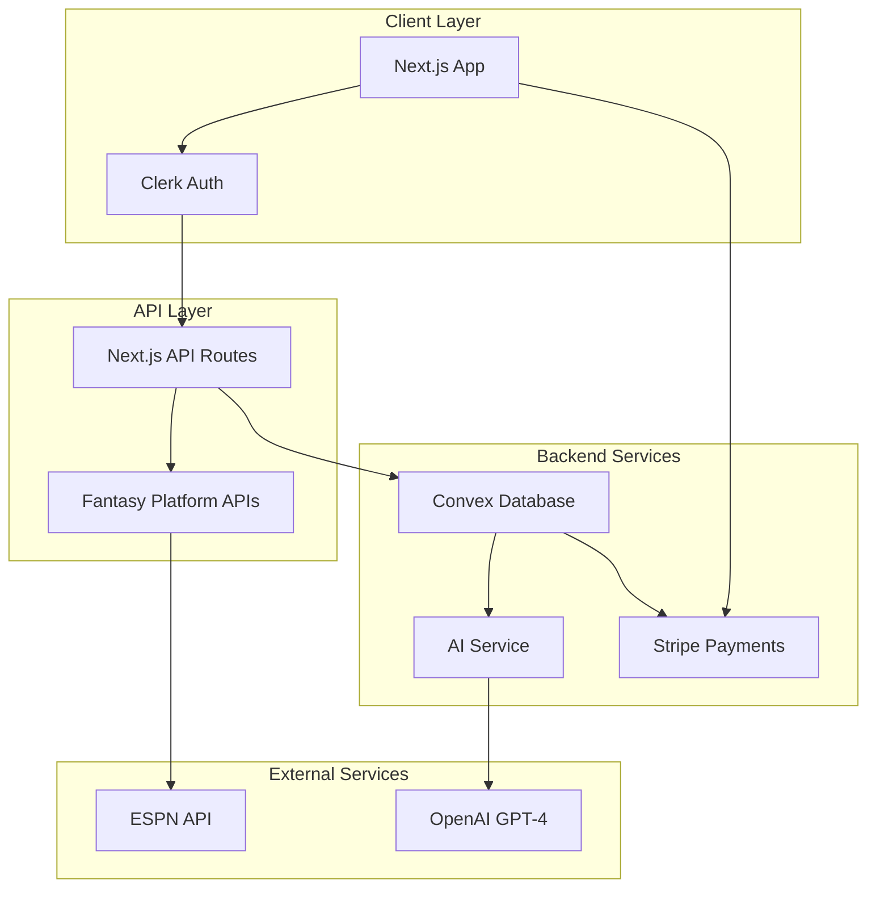

# FFSN Design Documents - MVP Implementation

## Table of Contents
1. [System Design Overview](#system-design-overview)
2. [User Flow Diagrams](#user-flow-diagrams)
3. [API Design](#api-design)
4. [Database Design](#database-design)
5. [UI/UX Design Guidelines](#uiux-design-guidelines)
6. [AI Content Generation Design](#ai-content-generation-design)

## System Design Overview

### MVP Architecture (Commissioner-First Approach)



### Data Flow for Commissioner Setup

1. **Commissioner Registration**
   - Signs up via Clerk
   - Creates organization (league)
   - Configures league settings

2. **League Data Import**
   - Enters ESPN league credentials
   - System fetches league data
   - Normalizes and stores in Convex

3. **Subscription Setup**
   - Selects subscription tier
   - Completes Stripe payment
   - League members gain access

4. **AI Content Generation**
   - Scheduled jobs analyze league data
   - AI generates personalized content
   - Content distributed to members

## User Flow Diagrams

### Commissioner Onboarding Flow

```
┌─────────────────┐     ┌──────────────────┐     ┌─────────────────┐
│                 │     │                  │     │                 │
│  Landing Page   │────▶│  Sign Up/Login   │────▶│  Create League  │
│                 │     │     (Clerk)      │     │                 │
└─────────────────┘     └──────────────────┘     └─────────────────┘
                                                           │
                                                           ▼
┌─────────────────┐     ┌──────────────────┐     ┌─────────────────┐
│                 │     │                  │     │                 │
│ View Dashboard  │◀────│ Select Plan &    │◀────│ Import ESPN     │
│                 │     │    Payment       │     │     Data        │
└─────────────────┘     └──────────────────┘     └─────────────────┘
```

### AI Content Generation Flow

```
┌──────────────┐     ┌─────────────────┐     ┌──────────────────┐
│              │     │                 │     │                  │
│ Fetch League │────▶│ Analyze Recent  │────▶│ Select Writer    │
│     Data     │     │    Activity     │     │    Persona       │
└──────────────┘     └─────────────────┘     └──────────────────┘
                                                       │
                                                       ▼
┌──────────────┐     ┌─────────────────┐     ┌──────────────────┐
│              │     │                 │     │                  │
│   Publish    │◀────│ Review & Edit   │◀────│ Generate Content │
│              │     │   (Optional)    │     │     with AI      │
└──────────────┘     └─────────────────┘     └──────────────────┘
```

## API Design

### RESTful API Endpoints

```typescript
// League Management
POST   /api/leagues                 // Create new league
GET    /api/leagues/:id            // Get league details
PUT    /api/leagues/:id            // Update league settings
POST   /api/leagues/:id/import     // Import ESPN data

// AI Content
POST   /api/content/generate       // Generate new article
GET    /api/content/:leagueId     // Get league articles
POST   /api/content/:id/publish   // Publish article

// Subscription Management
POST   /api/subscriptions/create-checkout    // Create Stripe session
POST   /api/subscriptions/webhook           // Stripe webhook
GET    /api/subscriptions/:leagueId/status // Get subscription status

// Commissioner Tools
GET    /api/commissioner/analytics         // League analytics
POST   /api/commissioner/invite-members   // Send invites
PUT    /api/commissioner/credit-allocation // Manage credits
```

### Convex Functions Structure

```typescript
// convex/leagues.ts
export const create = mutation({
  args: {
    name: v.string(),
    platform: v.literal("espn"),
    externalId: v.string(),
    settings: v.object({
      scoringType: v.string(),
      rosterSize: v.number(),
    }),
  },
  handler: async (ctx, args) => {
    // Implementation
  },
});

// convex/ai.ts
export const generateArticle = action({
  args: {
    leagueId: v.id("leagues"),
    contentType: v.string(),
    persona: v.string(),
  },
  handler: async (ctx, args) => {
    // Implementation
  },
});

// convex/subscriptions.ts
export const updateSubscription = mutation({
  args: {
    leagueId: v.id("leagues"),
    tier: v.string(),
    stripeSubscriptionId: v.string(),
  },
  handler: async (ctx, args) => {
    // Implementation
  },
});
```

## Database Design

### Core Tables (Convex Schema)

```typescript
// Simplified MVP Schema
export default defineSchema({
  // User management via Clerk organizations
  leagues: defineTable({
    clerkOrgId: v.string(),
    name: v.string(),
    platform: v.literal("espn"),
    externalId: v.string(),
    commissionerEmail: v.string(),
    settings: v.object({
      scoringType: v.string(),
      rosterSize: v.number(),
      playoffWeeks: v.number(),
      categories: v.array(v.string()),
    }),
    subscription: v.object({
      tier: v.string(),
      status: v.string(),
      stripeCustomerId: v.optional(v.string()),
      stripeSubscriptionId: v.optional(v.string()),
      creditsRemaining: v.number(),
      creditsMonthly: v.number(),
    }),
    lastSync: v.number(),
  }).index("by_clerk_org", ["clerkOrgId"]),

  teams: defineTable({
    leagueId: v.id("leagues"),
    externalId: v.string(),
    name: v.string(),
    owner: v.string(),
    record: v.object({
      wins: v.number(),
      losses: v.number(),
      ties: v.number(),
    }),
    roster: v.array(v.object({
      playerId: v.string(),
      playerName: v.string(),
      position: v.string(),
      team: v.string(),
    })),
  }).index("by_league", ["leagueId"]),

  aiContent: defineTable({
    leagueId: v.id("leagues"),
    type: v.string(), // "recap", "preview", "analysis", etc.
    persona: v.string(),
    title: v.string(),
    content: v.string(),
    metadata: v.object({
      week: v.optional(v.number()),
      featured_teams: v.array(v.id("teams")),
      credits_used: v.number(),
    }),
    status: v.string(), // "draft", "published", "scheduled"
    publishedAt: v.optional(v.number()),
  }).index("by_league", ["leagueId"])
    .index("by_status", ["status"]),

  weeklyStats: defineTable({
    leagueId: v.id("leagues"),
    week: v.number(),
    teamStats: v.array(v.object({
      teamId: v.id("teams"),
      score: v.number(),
      projectedScore: v.number(),
      rank: v.number(),
    })),
    topPerformers: v.array(v.object({
      playerId: v.string(),
      playerName: v.string(),
      points: v.number(),
      teamId: v.id("teams"),
    })),
  }).index("by_league_week", ["leagueId", "week"]),
});
```

## UI/UX Design Guidelines

### Design System Specifications

```scss
// Color Palette (ESPN-inspired)
$colors: (
  // Primary
  primary-red: #C8102E,
  primary-dark: #1E1E1E,
  
  // Grays
  gray-900: #0C0C0C,
  gray-800: #1A1A1A,
  gray-700: #2B2B2B,
  gray-600: #3C3C3C,
  gray-500: #6B6B6B,
  gray-400: #8C8C8C,
  gray-300: #B4B4B4,
  gray-200: #D4D4D4,
  gray-100: #EDEDED,
  
  // Accent
  accent-green: #00A656,
  accent-yellow: #FFB81C,
  
  // Team Colors (Dynamic)
  team-primary: var(--team-primary),
  team-secondary: var(--team-secondary),
);

// Typography
$typography: (
  // Headings
  h1: (size: 48px, weight: 900, line: 1.1),
  h2: (size: 36px, weight: 800, line: 1.2),
  h3: (size: 28px, weight: 700, line: 1.3),
  h4: (size: 22px, weight: 700, line: 1.4),
  
  // Body
  body-lg: (size: 18px, weight: 400, line: 1.6),
  body: (size: 16px, weight: 400, line: 1.5),
  body-sm: (size: 14px, weight: 400, line: 1.5),
  
  // Special
  stat-large: (size: 64px, weight: 900, line: 1),
  label: (size: 12px, weight: 600, line: 1.2, transform: uppercase),
);

// Spacing System
$spacing: (
  xs: 4px,
  sm: 8px,
  md: 16px,
  lg: 24px,
  xl: 32px,
  2xl: 48px,
  3xl: 64px,
);

// Component Patterns
$components: (
  card: (
    radius: 8px,
    shadow: 0 2px 8px rgba(0,0,0,0.1),
    border: 1px solid $gray-200,
  ),
  button: (
    radius: 6px,
    padding: 12px 24px,
    transition: all 0.2s ease,
  ),
);
```

### Key UI Components

#### 1. League Dashboard
```
┌────────────────────────────────────────────────────────────┐
│ FFSN                                    [Commissioner Tools] │
├────────────────────────────────────────────────────────────┤
│                                                             │
│  ┌─────────────────┐  ┌─────────────────┐  ┌────────────┐ │
│  │   Week 8        │  │   Standings     │  │  AI News   │ │
│  │   In Progress   │  │   1. Team A     │  │            │ │
│  │                 │  │   2. Team B     │  │  [Generate]│ │
│  │  134-127       │  │   3. Team C     │  │            │ │
│  └─────────────────┘  └─────────────────┘  └────────────┘ │
│                                                             │
│  Recent AI Articles                          Credits: 185   │
│  ┌───────────────────────────────────────────────────────┐ │
│  │ • Week 7 Recap: Upsets Galore! - Mel Diaper          │ │
│  │ • Trade Analysis: The Big Deal - The Insider         │ │
│  │ • Power Rankings Week 8 - The Statistician          │ │
│  └───────────────────────────────────────────────────────┘ │
└────────────────────────────────────────────────────────────┘
```

#### 2. AI Content Generator Interface
```
┌────────────────────────────────────────────────────────────┐
│ Generate AI Content                                    [X]  │
├────────────────────────────────────────────────────────────┤
│                                                             │
│  Content Type: [Weekly Recap     ▼]                        │
│                                                             │
│  Writer Persona:                                            │
│  ┌─────┐ ┌─────┐ ┌─────┐ ┌─────┐ ┌─────┐                 │
│  │ Mel │ │Stats│ │Hype │ │Trade│ │Comm │                 │
│  └─────┘ └─────┘ └─────┘ └─────┘ └─────┘                 │
│                                                             │
│  Featured Teams: [Select teams...]                          │
│                                                             │
│  Additional Context:                                        │
│  ┌───────────────────────────────────────────────────────┐ │
│  │                                                       │ │
│  └───────────────────────────────────────────────────────┘ │
│                                                             │
│  Credits Required: 10          [Generate Content]          │
└────────────────────────────────────────────────────────────┘
```

## AI Content Generation Design

### Persona Prompt Templates

```typescript
const personaTemplates = {
  "mel-diaper": {
    systemPrompt: `You are Mel Diaper, a bombastic fantasy football 
    analyst known for hot takes and dramatic reactions. You're often 
    wrong but never in doubt. You take credit for correct predictions 
    and blame others for your misses. Use ALL CAPS for emphasis and 
    include at least one outrageous comparison per article.`,
    
    styleGuide: {
      tone: "Outraged, confident, entertaining",
      vocabulary: "Colorful, hyperbolic, accessible",
      structure: "Short paragraphs, punchy sentences",
      signature_phrases: [
        "ARE YOU KIDDING ME?!",
        "I CALLED IT!",
        "This is EXACTLY why I said...",
        "WORST draft pick in HISTORY!"
      ]
    }
  },
  
  "the-statistician": {
    systemPrompt: `You are The Statistician, a data-driven analyst 
    who provides premium insights based on advanced metrics. Focus on 
    efficiency ratings, trend analysis, and predictive modeling. Always 
    support claims with specific numbers and percentages.`,
    
    styleGuide: {
      tone: "Authoritative, precise, educational",
      vocabulary: "Technical, analytical, clear",
      structure: "Data tables, bullet points, clear sections",
      metrics_focus: [
        "Target share",
        "Red zone efficiency",
        "YAC (Yards After Catch)",
        "Defensive matchup ratings"
      ]
    }
  }
};
```

### Content Generation Pipeline

```typescript
interface ContentGenerationRequest {
  leagueId: string;
  contentType: ContentType;
  persona: PersonaType;
  weekNumber: number;
  featuredTeams?: string[];
  additionalContext?: string;
}

class AIContentPipeline {
  async generateContent(request: ContentGenerationRequest) {
    // 1. Data Collection
    const leagueData = await this.fetchLeagueData(request.leagueId);
    const weekData = await this.fetchWeekData(request.weekNumber);
    
    // 2. Context Building
    const context = this.buildContext({
      standings: leagueData.standings,
      recentGames: weekData.games,
      topPerformers: weekData.topPerformers,
      transactions: leagueData.recentTransactions,
    });
    
    // 3. Prompt Construction
    const prompt = this.constructPrompt(
      request.persona,
      request.contentType,
      context,
      request.additionalContext
    );
    
    // 4. AI Generation
    const content = await this.callAI(prompt);
    
    // 5. Post-processing
    return this.postProcess(content, request.persona);
  }
}
```

### Content Types and Templates

```typescript
enum ContentType {
  WEEKLY_RECAP = "weekly_recap",
  MATCHUP_PREVIEW = "matchup_preview",
  POWER_RANKINGS = "power_rankings",
  TRADE_ANALYSIS = "trade_analysis",
  WAIVER_WIRE = "waiver_wire",
  DRAFT_GRADES = "draft_grades",
  MIDSEASON_AWARDS = "midseason_awards",
  PLAYOFF_PREVIEW = "playoff_preview"
}

const contentTemplates = {
  [ContentType.WEEKLY_RECAP]: {
    sections: [
      "headline_matchup",
      "biggest_upset",
      "top_performers",
      "disappointments",
      "looking_ahead"
    ],
    dataRequired: [
      "all_matchup_results",
      "player_scores",
      "projected_vs_actual",
      "season_standings"
    ],
    creditCost: 10
  },
  
  [ContentType.TRADE_ANALYSIS]: {
    sections: [
      "trade_details",
      "winner_loser_analysis",
      "impact_on_standings",
      "rest_of_season_outlook"
    ],
    dataRequired: [
      "trade_players",
      "team_needs",
      "player_stats",
      "schedule_difficulty"
    ],
    creditCost: 5
  }
};
```

### Implementation Timeline

#### Week 1-2: Foundation
- Set up Next.js project with TypeScript
- Configure Tailwind CSS + shadcn/ui
- Implement Clerk authentication
- Set up Convex backend

#### Week 3-4: Commissioner Features
- League creation flow
- ESPN data import (manual entry initially)
- Basic dashboard UI
- Stripe subscription setup

#### Week 5-6: AI Integration
- OpenAI API integration
- Implement 2 personas (Mel Diaper + Statistician)
- Content generation UI
- Credit system

#### Week 7-8: Polish & Launch
- Complete all 5 personas
- Email notifications
- Performance optimization
- Beta testing with 10 leagues

This design document provides a focused approach to building the MVP with commissioner-first features and AI content generation at the core.